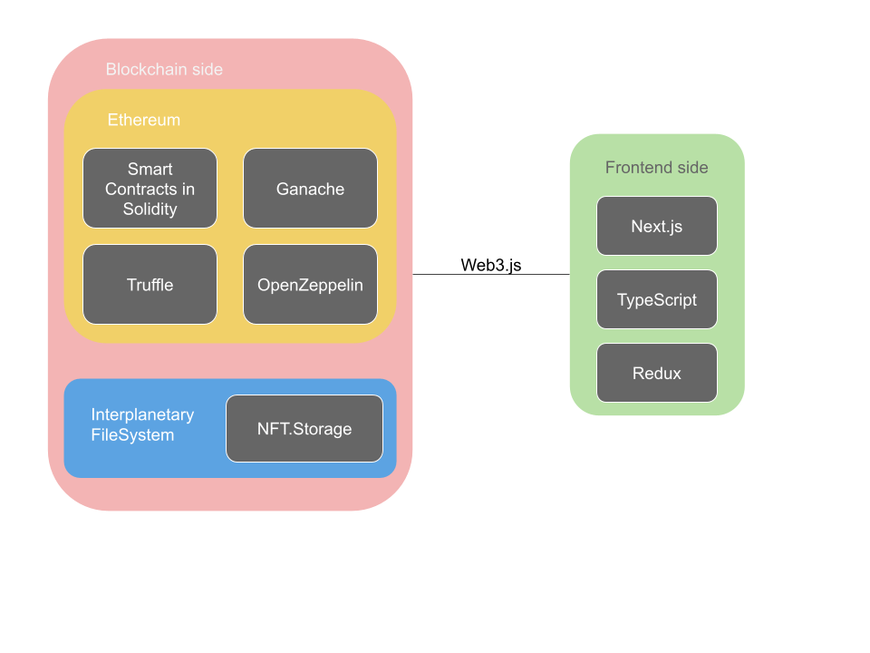
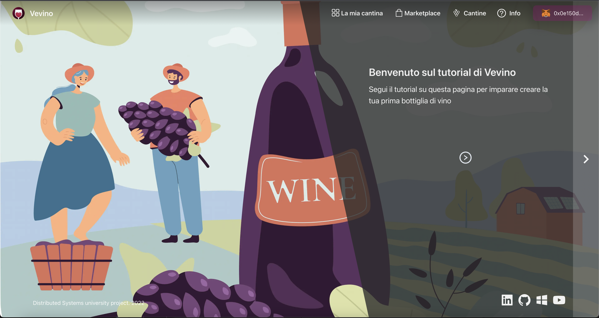
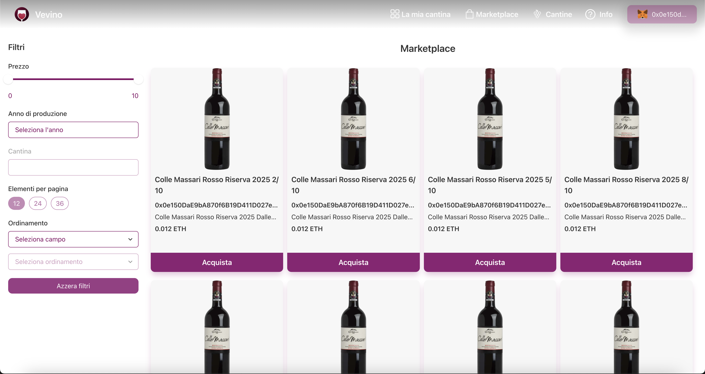
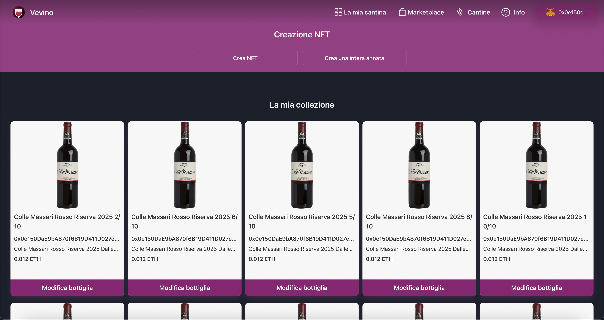

# NFT-Marketplace

## Introduction <a name="introduction"></a>

This is a simple university project to show the potentiality of Web3. The aim of the project is to show how many of the current services that are centralized can be decentralized with the help of blockchain.

I do not own any registered brand name which I'll use on this project, this is not a commercial project, it's just a business idea made by myself (many aspects of the business idea are not implemented like the shipping option when a bottle is actually created and ready to be shipped).

If your brand is on this project and you want it to be removed please contact me on GitHub and I'll do it.


## Table of contents <a name="table_of_contents"></a>

- [NFT-Marketplace](#nft-marketplace)
  - [Introduction ](#introduction-)
  - [Table of contents ](#table-of-contents-)
  - [Commercial side ](#commercial-side-)
  - [Technical side ](#technical-side-)
    - [Run the project ](#run-the-project-)
    - [Tech stack ](#tech-stack-)
    - [Smart Contracts ](#smart-contracts-)
    - [Blockchain architecture ](#blockchain-architecture-)
    - [IPFS ](#ipfs-)
    - [Frontend Web3.js ](#frontend-web3js-)
  - [Site architecture ](#site-architecture-)
    - [Pages ](#pages-)
    - [Usage flow ](#usage-flow-)
      - [Winery flow: ](#winery-flow-)
      - [Customer flow: ](#customer-flow-)
  - [Some business ideas ](#some-business-ideas-)
  - [Missing features ](#missing-features-)
  - [Final notes ](#final-notes-)


## Commercial side <a name="commercial_side"></a>

This is an app where the users can buy and sell bottles of wine. The user can link their personal wallet to the platform using the site, this will let the users use their crypto wallet. The bottles of wine are represented by a NFT which will identify one single bottle. Buying a NFT from the producer means having a preorder of an "old" wine, while the consumer has the certainty of having a bottle as soon the wine will be available, the producer will receive money to invest on his work.

There are two kind of users:


* The consumer is the user who buys bottles from other users and from the producers, he cannot create new NFTs, but can sell one NFT if he does not want the bottle anymore or if he sees that a particular wine is increasing its market value.
* The producer is the user that produces the wine, he can create new NFT based on the real production of wine. Producers may have to be certified when entering the platform (just to be sure he is who he claims to be, this removes frauds, when authenticated he will be "anonymous" like others users).

The business idea should be to adjust correctly the fees to reward the Ethereum net that let the magic happen and another fee to help the platform to release new features, fix bugs and improve smart contracts (and let the devs live happily).


## Technical side <a name="technical_side"></a>



Image 1. Architectural view of the project with the main tools used and how they are connected together


### Run the project <a name="run_the_project"></a>


* To launch the project, clone the repo.
* Navigate inside the repo where the package.json is.
* Install all the dependencies using `npm install`. (Watch out for potentially errors, they could be related to `react-no-ssr`, those can be resolved removing this package from the package.json remove node_modules folder and then again `npm i`)
* Create a config folder with a config file inside with a structure like: \


```typescript
export const NFT_storage_config = {
    serviceName: 'https://nft.storage/',
    apiKey: 'apiKey'
};
```


* Build the project using npm run build.
* Launch the project using npm start.

---
### Tech stack <a name="tech_stack"></a>

Tools used: 


* Next.js with TypeScript, CSS modules, this includes internal tools like react, react-router, etc.
* [ChakraUI](https://chakra-ui.com/) and [React95](https://github.com/React95/React95) as UI libraries for React.
* fetch API is used to create requests against the decentralized file system (since there is only one request type to post data inside the IPFS there's no need to use external packages like axios).
* Redux-toolkit to manage internal state.
* Web3.js package to connect frontend to solidity contracts.
* Solidity to build smart contracts.
* Ganache to create a testnet to connect to and test the entire blockchain side project.
* Truffle to create contracts, manage files, deploy and compile .sol files. (Maybe in future I'll try some other project using more standard tools like Hardhat)
* OpenZeppelin is used to have the base contracts to inherit most of the solidity logic.
* To store data relative to subscribed wineries or users I did a simple json file.
* To store NFTs related data I used [NFT.Storage](https://nft.storage/) that is a decentralized storage option - based on Filecoin, it is an IPFS - Interplanetary File System.
---

### Smart Contracts <a name="smart_contracts"></a>

To create the blockchain side of the project I tried using Solidity to code the functions and transactions. \
Inside the main folder there's a folder called contracts where all the blockchain related files are stored: custom source files, imported OpenZeppelin source files and compiled ABI files.

In the NFTMarketplace.sol (path: contracts\contracts) file there are all the custom parts coded by me.

All the dependencies written above like the OpenZeppelin needs to be included in a package.json file like it would be done for a normal js package, launching `npm i` would install the dependency and let the user use it in solidity. \
At the top of the file there are the declarations of most of the variables that will be used in the next functions, with a particular focus on Transaction struct and Sale event. The smart contract inherits from ERC721 that is one of the most used standards to mint and to transfer NFTs in a secure way (another one that I could use was ERC-1155). Extending the ERC-721 lets me have methods like _safeMint that are really useful to mint a new NFT.

The most used and "complex" functions are:

* `payToMint` used to mint new NFTs, it gets some info from the frontend and creates the NFT using an URI from the chosen file storage where information like the image and a little object in JSON format are stored. It needs 5 arguments:
    * `string memory title`: the title of the NFT that is going to be minted,
    * `string memory description`: a little description to associate to the NFT,
    * `string memory metadataURI`: the URI where other sensitive data are stored, like the image, this will create the uniqueness of the NFT since this is created by an IPFS (this will be specified in IPFS paragraph),
    * `uint256 salesPrice`: the price that the NFT will have,
    * `string memory year` the year of the production of the NFT (this is meaningful for a user since it shows when the user will receive the bottle).
* `payToBuy` used to send ETH to another user and receive the chosen NFT from the owner. It needs only an argument:
    * `uint256 id`: is the id of the NFT the user wants to buy.
* `changePrice` to change price to an existing NFT, this is useful for users that do not want a NFT anymore so they can sell it as privates and they will go in the marketplace for everyone else registered on the site. \
It needs two arguments:
    * `uint256 id`: the id of the NFT which price will be changed,
    * `uint256 newPrice`: the new price the NFT will have.
* `changePrivacy`, this function is the same as changePrice but it can avoid a NFT to be visible in the marketplace (it is still visible in My Wine Cellar page so the user can still change the price or put it back on sale). It also provides an internal check when a user tries to buy it from frontend vulnerabilities because inside the payToBuy there is a requirement that asks the NFT to be buyable, otherwise the sale won't complete with success. \
It needs two arguments like the changePrice method:
    * `uint256 id`: the id of the NFT which privacy will be changed,
    * `bool isBuyable`: the property that indicates whether a NFT is buyable by other users or not.
* `getAllNFTs` used to retrieve all the NFTs that are minted until now (only the ones relative to this contract, not from previous versions). It doesn't need any arguments.
* `getNFT` is used to retrieve NFT from the net, it needs the id of the NFT.

---
### Blockchain architecture <a name="blockchain_architecture"></a>

Since Solidity relies on Ethereum blockchain I could choose between Hardhat and Truffle to initially scaffold the project and to deploy it. 

Both of them are two tools to scaffold, test and deploy solidity projects, the two were even not too far apart in terms of complexity, but I decided to use Truffle with Ganache when I tried for a bit the UI of Ganache. \
So once I downloaded Ganache it just needed to create a new workspace, which would give the developer a testnet with 10 accounts with their respective wallet addresses and a balance of 100ETH (fake obviously).

The most important part here is to correctly configure the Ganache workspace to deploy into the correct testnet, in fact Ganache needs a port and an ip address. 

These configurations must be inserted in the `truffle-config.js` file, which is a simple module of javascript that will be used to create the build files.

Right below there's the example I used for this project (no sensitive data):


```json
development: {
    host: "127.0.0.1",     // Localhost (default: none)
    port: 7545,            // Standard Ethereum port (default: none)
    network_id: "5777",    // 5777 (default: none)
},
```


Though this was my configuration to test in ganache I could use the default testnet that truffle created for me with the help of Goerli, this is one of the many other tools available to create a local testnet.

Once the configuration is done I went on to build the files with the correct deploy script, this must be coded inside migrations folder, creating a file called 2_deploy_contracts.js to specify some internal information that truffle needs to deploy correctly in the Ganache workspace, example below (as before, no sensitive data):


```typescript
const WineNFT = artifacts.require('WineNFT');

module.exports = async (deployer) => {
    const accounts = await web3.eth.getAccounts();
    await deployer.deploy(
        WineNFT,
        'Wine NFTs',
        'WNR', 10, accounts[1]
    );
};
```


When the files are ready I just had to launch `truffle migrate` and it will build files into a build folder, now the only thing I should do in order to let the testnet work properly with the new files is to copy those files and put them inside the path `contracts/build/contracts`.

If I need to update smart contracts with some other logic I just need to launch  `truffle migrate` another time and again copy and paste the built files.

---

### IPFS <a name="ipfs"></a>

Since storing data like images (but also creating a db) is really expensive to be held in a blockchain I decided to use an external decentralized service called NFT.Storage which doesn't have a cap limit, other possible options could be Web3.storage which is still free with a cap limit of 5GB.

To gain access to NFT.Storage the app needs a file of configurations where apiKey and service name are stored, without these two the dApp won't work as intended.

Before running a method to mint the NFT into the blockchain I create a metadataURI storing a little object with data and an image in the IPFS, the resulting metadataURI is sent with a name and some other information to the Smart contract that will hash the data and mint the NFT.

The UI will receive a boolean and an error if the boolean is false to know if the request succeeded or failed, in the last case the error is shown in the popup where the user has pressed the create button.

---
### Frontend Web3.js <a name="frontend_web3.js"></a>

To connect solidity with the frontend I used the Web3.js package installed in React using npm. \
This package will create an instance of ethereum in the window object of the browser and then connect to the testnet to get the contracts, doing this it will have all the methods and internal states to retrieve NFTs and related information.

Inside the file `contracts_connections` you can find all the method that create a connections between frontend and blockchain, those are all asynchronous methods to not block the frontend app execution and wait for the result, in particular:


* `loadWeb3`: this method retrieves the smart contract information and other methods. \
It doesn't need any arguments to be passed in function call, but it needs external information from a json file that is created when truffle compiles the project (see previous sections). \
When the connection is set the function will retrieve all the NFTs and set them inside the Redux store to be visible in the entire app.
* `mintNFT`: is used to call the mint function of the smart contract, it needs the complete NFT object so it can get by itself what it really needs, there is also a utilities function called inside which is toWei to convert the Ether price into Wei (smallest ether unit value, it is suggested to do calculations and others always in Wei and convert them into Ether only to show them to the final user or to get the value from them.)
* `buyNFT`: it is used to buy a NFT from the marketplace, the UI passes the entire object to the function but it deconstructs the object to get only the NFT id and the price since all the other relevant data is already stored into the NFT inside the blockchain.
* `updateNFT`: it is used to change price to a NFT, it needs NFT id and new price, but I decided to pass the entire NFT data and then deconstruct it to get just the variables needed.
* `updateNFTPrivacy`: it is used to change the privacy of a NFT, as per updateNFT, it needs just the id and the new boolean value for isBuyable, but it got the entire NFT data to be deconstructed during call.
* `getNFTs`: it is used to get all the NFTs, it doesn't need any parameter to be called correctly.

---
## Site architecture <a name="site_architecture"></a>


### Pages <a name="pages"></a>

There are 4 main pages in the project (home and then menu bar from right to left):

* Home, it shows a landing page and some info regarding the site, showing some wineries and a call-to-action to register to the mailing list (this does not send real emails and does not store inserted email in any db).
  


* Info page: this page is created with the aim to teach a potential user on how to use the site. For simplicity and since the user doesn't need to know every specific aspect of the dApp the NFT word won't be shown in any page of the onboarding page, instead it will be used the word bottle. In the 'Info' page there are instructions to create a bottle, to buy one from the marketplace, to stop the sale or to put it again on sale.



* Wineries page is a page where some of the best and biggest subscribed wineries are shown with a little description and an easy way to go to their website.


* Marketplace: this page allows the user to buy NFTs from wineries and from other users, it has a section where the user can filter and/or sort the NFTs by some NFTs internal properties.



* My Wine Cellar: this page is where previously bought NFTs and minted NFTs are, from this page Wineries can also mint new NFTs with two buttons one to mint just one bottle and another one to mint from 1 to 50 bottles (the site will automatically appends a string that will go from 1 to the requested amount to differentiate the NFs - since most of the time a winery will create from 50 to 400 bottles from each barrel).



At the top you can also see a button "Connect wallet" which allows the user to connect his MetaMask wallet to the site and then correctly use the site.

When the user has connected the wallet he can always disconnect by clicking on his wallet address from the button and clicking on disconnect, this will disconnect the user from the site, removing the address from the session storage.


### Usage flow <a name="usage_flow"></a>


#### Winery flow: <a name="winery_flow"></a>

Disclaimer: This project didn't focus in the signin/signup phase so I have put inside the file called `WinemakersDB.json` in the WinemakersDB folder some wallet addresses that refers to Winemakers. \
The idea was to create the signin/signup modal but it wasn't possible because to avoid a potentially malicious user to mint fake bottle the project needs a human factor to check the real identity of a winery like an italian P.Iva or some other paper that can be used to identify the winery from a normal user. 


* A winery should be registered on the site to start using it, it connects its own wallet with the button on the top right side of the site.
* The browser should prompt the MetaMask popup to authorize the user to connect his wallet to the site.
* One of the first things the winery should do is read carefully how to create the first bottle in the 'Info' page.
* Then it should go to the 'My Collection' page and press one of the two buttons at the top, Create a new bottle or Create multiple bottles.
* Both led the winery to a modal which is the same for both but in the case of multiple bottle at the end of the form there is a number input to set the amount of bottle to be created, furthermore in multiple creation once the form is filled and sent the app will append to the title of each bottle a number from 1 to the requested amount (1/10,…,10/10). \
To create a bottle successfully the dApp will show a popup from MetaMask to accept to mint the NFT, one for each bottle that the winery wants to create.
* Now if the creation has succeeded the new bottles are ready to be sold in the Marketplace page, they will be visible for the entire community (other wineries can buy other bottles too).
* A winery can change the price simply by clicking on the bottle it wants to change. Same applies to privacy.


#### Customer flow: <a name="customer_flow"></a>

(most of the above points applied to customer too)

* Users can connect their wallet to the site like the wineries, the same popup by MetaMask will be shown.
* First thing to do is always read carefully the 'Info' page, to know what a user can do with the app.
* Since the user cannot create any bottle it should then go to the Marketplace and buy the bottles he wants. \
MetaMask will prompt a popup to ask for consent to buy the bottle.
* If the sale is successful the new bottle will be visible in the My Collection page of the user. When a bottle is bought it will be immediately set as non sellable, to prevent other users to buy it instantly after the sale
* The user, like the winery, can change price or privacy simply by clicking on the bottle and asking for the requests he wants to do.


## Some business ideas <a name="business_idea"></a>

One of the most useful and rewarding (for the devs that need to bill for something) could be that users can pay a fee to let their bottles be ahead of other sellers, so I was thinking to implement a 'In evidence' tag that could take the user focus and to put these bottles in a better position in Marketplace - maybe being sorted as first items or create a 'Featured' section at the top of the Marketplace.

I'd really like to change the Wineries page to create a map with an easy click on map feature that can open a country to show the wineries that are using this platform, this can induce more customers to connect their wallet and try to buy something.

Also widening the border or selling only bottles of wine to sell any alcoholic beverage could be an idea.


## Missing features <a name="missing_features"></a>

Though I tried my best to create filters for the Marketplace, the price filter is not correct, since it gives a range from 0 to 10, this is not a reasonable price range since a bottle with a current price of more that 1 ETH means it cost 1300€ (at the time I'm writing), so it's unbelievable to have a filter that filters between those numbers, it should be adjusted going from 0 to the highest NFT price currently in Marketplace.

Databases are missing in the entire project, although with Next.js the backend part could be easily done since there is a part regarding APIs and connected to a NoSQL db since the decentralized alternatives are not really used - by searching on internet it is widely known that many of them are not updated anymore or regularly.

The signin/signup is another great aspect missing that couldn't be made by me without a form of real claim to check the identity of a pretend-to-be winery.


## Final notes <a name="final_notes"></a>

The project lacks many business sides and obviously cannot be used as a platform to actually sell anything but set a base that can be improved with more features and improve the smart contracts to have features and more security.

The aim of the project seems to be successful because this was entirely made by just a developer, so if more people are involved into the project it could lead to a more complex POC that can give the start of a new business without the disadvantages of having a centralized server.

However, as I tried in my previous company, the advantages of switching from a centralized solution to a decentralized one is really difficult to explain to a non-IT customer. Also the current wine selling scenario on normal websites is going really well especially in places like Europe and California and there are already huge names like Vivino, Vino.com and Tannico that already have huge communities and a huge volume of affairs too. Sadly I don't really expect to be successful in a case where I need to present this idea at the next Vinitaly in Verona.

 \
Maybe the best way to use blockchain in this field is to tag with a QR code every bottle during the creation to let the final user know where it comes from and much other information and include this information into the current best sites.
